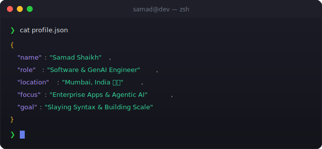

<!-- 
╔══════════════════════════════════════════════════════════════════════════════╗
║                                                                              ║
║   ███████╗███╗   ███╗ █████╗ ██████╗     ███████╗██╗      █████╗ ██╗   ██╗   ║
║   ██╔════╝████╗ ████║██╔══██╗██╔══██╗    ██╔════╝██║     ██╔══██╗╚██╗ ██╔╝   ║
║   ███████╗██╔████╔██║███████║██║  ██║    ███████╗██║     ███████║ ╚████╔╝    ║
║   ╚════██║██║╚██╔╝██║██╔══██║██║  ██║    ╚════██║██║     ██╔══██║  ╚██╔╝     ║
║   ███████║██║ ╚═╝ ██║██║  ██║██████╔╝    ███████║███████╗██║  ██║   ██║      ║
║   ╚══════╝╚═╝     ╚═╝╚═╝  ╚═╝╚═════╝     ╚══════╝╚══════╝╚═╝  ╚═╝   ╚═╝      ║
║                                                                              ║
║          🚀 SOFTWARE ENGINEER • FULL-STACK DEVELOPER • AI SPECIALIST 🚀      ║
║                                                                              ║
╚══════════════════════════════════════════════════════════════════════════════╝
-->

<div align="center">
  
  <!-- 🎯 ANIMATED HEADER -->
  
  
  <br/>
  
  <!-- 📊 PROFILE BADGES -->
  <a href="https://github.com/The-Syntax-Slayer">
    
  </a>
  &nbsp;
  <a href="https://github.com/The-Syntax-Slayer?tab=repositories">
    
  </a>
  &nbsp;
  <a href="https://github.com/The-Syntax-Slayer?tab=followers">
    
  </a>
  &nbsp;
  <a href="https://github.com/The-Syntax-Slayer">
    
  </a>
  
</div>

<br/>

<!-- 🖥️ TERMINAL INTRO SECTION -->
<div align="center">
  
</div>

<br/>


<br/>

<!-- 👤 ABOUT ME SECTION -->


<br/><br/>

<table>
<tr>
<td width="50%" valign="top">

### 🎯 Who I Am

```yaml
name: Samad Shaikh
alias: The Syntax Slayer
role: Software & AI Engineer
location: Mumbai, India 🇮🇳
status: Available Immediately ⚡

core_focus:
  - 🌐 High-Performance Full-Stack
  - 🤖 Applied GenAI & LLMs
  - 🔌 Asynchronous Backend Architectures
  - 🛡️ Cybersecurity & AppSec (SOLID)
  - 🗄️ Database Design & Optimization

philosophy: "Clean code. SOLID design. Agentic solutions."
```

</td>
<td width="50%" valign="top">

### 🚀 Technical Summary

I am a **Software Engineer & AI Integration Specialist** experienced in architecting, building, and deploying enterprise-grade applications. I combine core software engineering principles with modern Applied GenAI capabilities to build autonomous workflows and performant user interfaces.

*   **Engineering First:** Committed to write clean, maintainable, and fault-tolerant code using SOLID principles and async programming paradigms.
*   **Intelligent Systems:** Proficient in orchestrating LLMs (Google Gemini/Vertex AI), designing custom RAG pipelines, and implementing strict input/output verification logic.
*   **Full-Stack Ownership:** Able to take features from whiteboard planning to production-level cloud deployments.

</td>
</tr>
</table>

<br/>


<br/>

<!-- ⚡ TECH STACK -->


<br/><br/>

<div align="center">

<!-- 💻 LANGUAGES -->
<h4>💻 Core Languages & Polyglot Skills</h4>
<p>
  <a href="https://www.python.org/" target="_blank"></a>
  <a href="https://developer.mozilla.org/en-US/docs/Web/JavaScript" target="_blank"></a>
  <a href="https://www.typescriptlang.org/" target="_blank"></a>
  <a href="https://isocpp.org/" target="_blank"></a>
  <a href="https://www.oracle.com/java/" target="_blank"></a>
  <a href="https://www.postgresql.org/" target="_blank"></a>
  <a href="https://www.gnu.org/software/bash/" target="_blank"></a>
  <a href="https://developer.mozilla.org/en-US/docs/Web/HTML" target="_blank"></a>
  <a href="https://developer.mozilla.org/en-US/docs/Web/CSS" target="_blank"></a>
</p>

<!-- 🌐 WEB DEVELOPMENT -->
<h4>🌐 Frontend Engineering (React 19 & Next.js)</h4>
<p>
  <a href="https://reactjs.org/" target="_blank"></a>
  <a href="https://nextjs.org/" target="_blank"></a>
  <a href="https://vite.dev/" target="_blank"></a>
  <a href="https://tailwindcss.com/" target="_blank"></a>
  <a href="https://redux.js.org/" target="_blank"></a>
</p>

<!-- 🤖 AI & MACHINE LEARNING -->
<h4>🤖 Applied GenAI & LLM Integration</h4>
<p>
  <a href="https://deepmind.google/technologies/gemini/" target="_blank"></a>
  &nbsp;
  <a href="https://cloud.google.com/vertex-ai" target="_blank"></a>
  &nbsp;
  
  &nbsp;
  
  &nbsp;
  
</p>

<!-- 🔌 Distributed Backend & Databases -->
<h4>🔌 Distributed Backend & Databases</h4>
<p>
  <a href="https://fastapi.tiangolo.com/" target="_blank"></a>
  <a href="https://supabase.com/" target="_blank"></a>
  <a href="https://www.postgresql.org/" target="_blank"></a>
  <a href="https://redis.io/" target="_blank"></a>
</p>

<!-- 🔧 TOOLS & PLATFORMS -->
<h4>🔧 Infrastructure, DevOps & Tools</h4>
<p>
  <a href="https://aws.amazon.com/" target="_blank"></a>
  <a href="https://azure.microsoft.com/" target="_blank"></a>
  <a href="https://cloud.google.com/" target="_blank"></a>
  <a href="https://www.docker.com/" target="_blank"></a>
  <a href="https://git-scm.com/" target="_blank"></a>
  <a href="https://github.com/" target="_blank"></a>
  <a href="https://code.visualstudio.com/" target="_blank"></a>
  <a href="https://www.postman.com/" target="_blank"></a>
</p>

</div>

<br/>


<br/>

<!-- 💼 WORK EXPERIENCE SECTION -->
<h2>💼 Professional Experience</h2>

<br/>

### 🔹 Software Developer Intern — AI & Full-Stack
**Arova Technologies, Mumbai** | *July 2024 – Oct 2025*
*   Designed and built end-to-end full-stack applications with **Python** and **React**, adhering strictly to OOP paradigms and SOLID patterns.
*   Integrated **Google Gemini API** to automate text synthesis and content evaluation, enhancing downstream decision accuracy.
*   Formulated robust structured prompt templates and schema verification in Python, reducing LLM parser errors and improving data reliability.
*   Architected **Intern-Flow**, a multi-tier platform utilizing React, Supabase PostgreSQL, and custom dashboard analytical trackers from initial wireframes to production.
*   Engineered automated reporting analytics panels (**Recharts**) for user behavioral patterns, mood trends, and automated warning systems.

---

### 🔹 Data & Analytics Specialist
**Freelance, Mumbai** | *Sep 2022 – Jul 2023*
*   Successfully ran a 10-month engagement executing cleanups, quality assurance, and automated reporting systems for multiple clients.
*   Developed advanced scripting logic, pivot models, and verification layers to solve systemic relational database mismatch problems.

<br/>


<br/>

<!-- 🚀 KEY PROJECTS -->
<h2>🚀 Key Projects</h2>

<br/>

<table>
  <tr>
    <td width="50%" valign="top">
      <h3>🌟 Intern-Flow</h3>
      <p><em>Production Multi-Tier Enterprise Platform</em></p>
      <p>
        
        
        
        
        
      </p>
      <ul>
        <li>Architected a multi-tier administration suite supporting real-time workspace activity tracking and user reporting.</li>
        <li>Implemented Row-Level Security (RLS) policies and strict relational schemas inside Supabase PostgreSQL.</li>
        <li>Built dynamic UI reporting panels with Recharts, facilitating simple CSV data exports.</li>
      </ul>
    </td>
    <td width="50%" valign="top">
      <h3>⚡ PriMaX Hub</h3>
      <p><em>AI-Powered Multi-Module SaaS Application</em></p>
      <p>
        
        
        
        
        
      </p>
      <ul>
        <li>Designed a unified 4-module application covering Career Strategy, Intelligent Finance, Productivity, and Fitness.</li>
        <li>Integrated Google Gemini LLM (Vertex AI SDK) to power an AI Roadmap Generator and interactive Mock Interview engine.</li>
        <li>Engineered a real-time AI financial advisor parsing spend records and generating real-time suggestions overlaying visual dashboards.</li>
      </ul>
    </td>
  </tr>
</table>

<br/>


<br/>

<!-- 🎓 EDUCATION & CERTIFICATIONS -->
<h2>🎓 Education & Certifications</h2>

<br/>

<table>
<tr>
<td width="40%" valign="top">

### 📚 Education

*   **B.Sc. Computer Science**
    *   *M.P.S.P.S College — University of Mumbai*
    *   **CGPA:** 8.25 / 10 | 2023 - 2026
*   **HSC — Science**
    *   *RD National College* | 2022 - 2023
*   **SSC**
    *   *K.E.P School* | 85.5% | 2020 - 2021

</td>
<td width="60%" valign="top">

### 🏆 Professional Certifications

<details open>
<summary><b>Click to toggle certifications list (14 Credentials)</b></summary>
<br/>

*   🛡️ **GitHub:** GitHub Foundations Certificate
*   ☁️ **Google Cloud:** Cloud Digital Leader
*   🤖 **IBM:** AI Developer Professional Certificate
*   ⚙️ **IBM:** DevOps & Software Engineering
*   🌐 **IBM:** Full Stack Software Developer
*   📊 **Google:** Data Analytics Professional Certificate
*   🎨 **Meta:** Front-End Developer Certificate
*   💡 **Coursera:** Generative AI: Prompt Engineering
*   🖥️ **Microsoft:** Power Platform Fundamentals
*   💻 **Microsoft:** Azure AI Engineer Associate
*   📈 **Microsoft:** Azure Enterprise Data Analyst Associate
*   ☁️ **AWS:** AWS Cloud Practitioner Essentials
*   📊 **Harvard (edX):** Analyzing & Visualizing Data with Excel
*   🌐 **Udemy:** Advanced Web Development
</details>

</td>
</tr>
</table>

<br/>


<br/>

<!-- 📊 GITHUB ANALYTICS -->


<br/><br/>

<div align="center">
  
  <!-- GitHub Stats + Streak in ONE ROW -->
  <a href="https://github.com/The-Syntax-Slayer">
    
  </a>
  &nbsp;
  <a href="https://github.com/The-Syntax-Slayer">
    
  </a>
  
  <br/><br/>
  
  <!-- REAL-TIME LANGUAGE USAGE -->
  <a href="https://github.com/The-Syntax-Slayer">
    
  </a>
  
  <br/><br/>
  
  <!-- Activity Graph -->
  <a href="https://github.com/The-Syntax-Slayer">
    
  </a>
  
</div>

<br/>


<br/>

<!-- 🎮 CONTRIBUTION SHOWCASE -->


<br/><br/>

<div align="center">
  
  <!-- Pac-Man Contribution Graph pointing to dynamic output branch -->
  <picture>
    <source media="(prefers-color-scheme: dark)" srcset="https://raw.githubusercontent.com/The-Syntax-Slayer/The-Syntax-Slayer/output/pacman-contribution-graph-dark.svg"/>
    <source media="(prefers-color-scheme: light)" srcset="https://raw.githubusercontent.com/The-Syntax-Slayer/The-Syntax-Slayer/output/pacman-contribution-graph.svg"/>
    
  </picture>
  
  <br/>
  
  <sub>👾 Dynamically updated by GitHub Actions. Watch Pac-Man eat my bugs & syntax errors!</sub>
  
</div>

<br/>


<br/>

<!-- 🌐 CONNECT WITH ME -->


<br/><br/>

<div align="center">
  
<a href="https://github.com/The-Syntax-Slayer" target="_blank">
  
</a>
&nbsp;
<a href="https://linkedin.com/in/samad-ai" target="_blank">
  
</a>
&nbsp;
<a href="mailto:sxmxd.1825@gmail.com">
  
</a>
&nbsp;
<a href="https://the-syntax-slayer.github.io/" target="_blank">
  
</a>

</div>

<br/>


<br/>

<!-- 💡 RANDOM DEV QUOTE -->
<div align="center">
  
  ### 💭 Random Dev Quote
  
  <br/>
  
  <a href="https://github.com/The-Syntax-Slayer">
    
  </a>
  
</div>

<br/>

<!-- 🌟 FOOTER -->
<div align="center">
  
  
  
  <br/>
  
  <!-- ☕ BUY ME A COFFEE -->
  <a href="https://buymeacoffee.com/samadshaikh" target="_blank">
    
  </a>
  
  <br/><br/>
  
  
  
</div>
